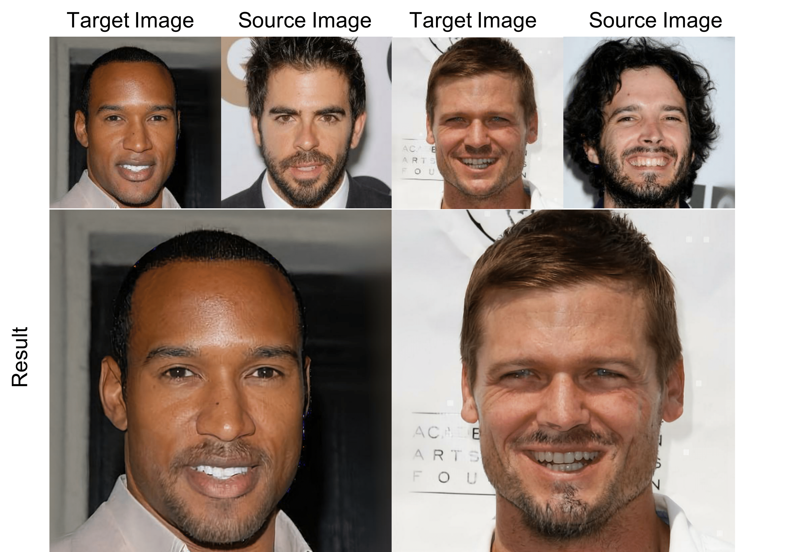

codes for ["Instance Level Facial Attributes Transfer with Geometry-Aware Flow"](http://arxiv.org/abs/1811.12670).


**Picture**: Our model can transfer facial attributes with realistic details under high resolution.

# Prerequisites
* Pytorch 0.4

# Preparing the dataset
download these datasets and put them under `celeba_data`:
* [celeba](http://mmlab.ie.cuhk.edu.hk/projects/CelebA.html)
* [CelebA-HQ](https://drive.google.com/open?id=0B4qLcYyJmiz0TXY1NG02bzZVRGs)
* download the [68 landmark annotation](https://drive.google.com/open?id=1SoHijOvjr9aL0wZUO-vJ_fCk6zo9pg4k) of CelebA dataset.

# Training
You can use different training options in `options.py`. Here is an example:
```bash
#!/usr/bin/env bash
job_name="goatee"
attr_name="Goatee"
    python -u train.py --n_blocks 3 --ngf 16 --ndf 64 --batch_size 24 --img_size 256\
    --sel_attrs $attr_name --name $job_name --gpu_ids 0 --use_lsgan --display_freq 50 \
    --lambda_gan_feat 5 --lambda_cls 2e-1 --print_freq 20 --lambda_flow_reg 1 --lambda_mask 1e-1
```

# Testing

The testing consists of two phases: creating the image folder to store input images and run models on those input images. You can create your own input folders or using scripts provided below.

* selecting inputs from celebA:
  ```bash
  python -u test.py --exp_folder $location_of_your_model --dataset_size 30\
   --which_epoch $num_epoch --which_iter $num_iter --attr_folder $your_input_folder \ 
   --result_folder $your_output_folder \
   --create_attr_folder --test_img_size 256
  ```
* testing on selected inputs from celebA:
  ```bash
    python -u test.py --exp_folder $location_of_your_model --dataset_size 30\
   --which_epoch $num_epoch --which_iter $num_iter --attr_folder $your_input_folder \ 
   --result_folder $your_output_folder --test_img_size 256
  ```

* selecting inputs from celebA-HQ:
  ```bash
  python -u test.py --exp_folder $location_of_your_model --dataset_size 30\
   --which_epoch $num_epoch --which_iter $num_iter --attr_folder $your_input_folder \ 
   --result_folder $your_output_folder \
   --create_attr_folder --is_hd --test_img_size 1024
  ``` 

* testing on selected inputs from celebA:
  ```bash
    python -u test.py --exp_folder $location_of_your_model --dataset_size 30\
   --which_epoch $num_epoch --which_iter $num_iter --attr_folder $your_input_folder \ 
   --result_folder $your_output_folder --test_img_size 1024 --is_hd
  ``` 

# Citation
If you use the codes, please cite the following publications:
```bibtex
@article{yin2019geogan,
  title={Instance Level Facial Attributes Transfer with Geometry-Aware Flow},
  author={Weidong Yin, Ziwei Liu and Chen Change Loy},
  booktitle = {AAAI Conference on Artificial Intelligence (AAAI)},
  month = {February},
  year = {2019} 
}
```
